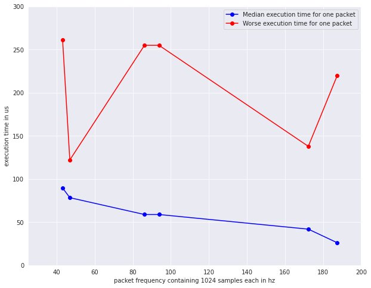
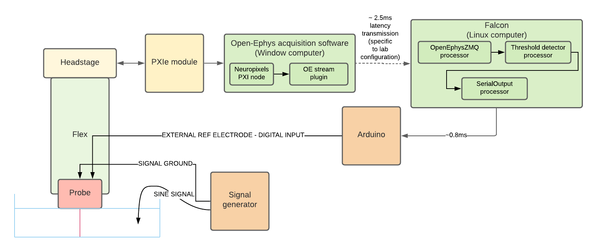
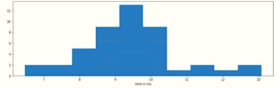

# Stream plugin

This is an Open-Ephys streaming plugin with low latency for continuous dataflow. Data are packaged in a Flatbuffer schema
and send via ZMQ communication,  enabling the creation of advanced visualization and monitoring add-ons in multiple languages (C++, python).

## Installation
### Dependencies (automatically installed at build time)

- ZMQ lib - shared lib for windows, linux, and mac already included for the plugin
- Flatbuffer lib - build at built time (via cmake FetchContent)

## Main usage 

Communication setup with the OpenEphysZMQ Falcon processor. 

## How to create your own client

- ZMQ communication as Subscriber (no source id)
- copy the schema fbs to decode the Flatbuffer packet

For more details, look into the client folder in the repository

## Benchmarking

Two points can be optimized here to reduce the latency streaming known as the concept of "fast and small".

This benchmark has been done by measuring for different frequencies set in Open-Ephys GUI the time to 
encode the package and sent it.

In terms of size, the Flatbuffer packaging is always adding exactly 64 bits to the raw data. 

## Special use-case and round trip obtained 

This plugin has been originally developed to stream Neuropixels data with low latency from Open-Ephys to Falcon.
[Falcon](https://falcon-core.readthedocs.io/en/latest/) is a software used for low-latency real-time processing such as ripple detection and decoding use-case. 

A sinusoidal signal was generated in the saline liquid. All 384 channels + the digital signal were streamed by Open-Ephys. 
In falcon, a simple threshold applied on one of the channel was used to generate events transferred by the arduino as a 
square signal in the digital input of the Neuropixels.

The round-trip latency was measured for the experiment by comparing the Neuropixels digital input (raising edge of the square signal) 
recorded in Falcon with the timestamps of events generated by the Falcon threshold crossing node. 

- Median delay: 9.241ms
- Standard deviation: 1.302ms